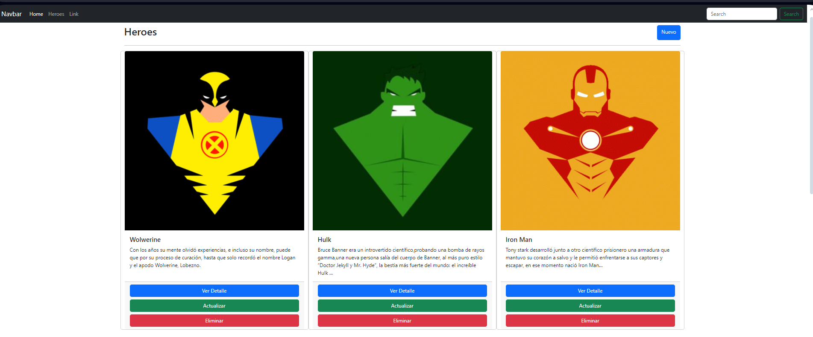

##  Heroes_WebApp 

Se trata de un proyecto web hecho en lenguaje C#, esta administra un listado de Heroes.
 
Los usuarios pueden realizar las tareas básicas de un CRUD (leer, modificar, crear y eliminar registros).

### Tecnologías utilizadas:
 - Se utilizó Programación Orientada a Objetos.
 - NET Framework 4.8
 - SQL Server
 - ADO.NET Entity Framework 6
 - ASP.Net Framework
 - Modelo Vista Controlador
 - Bootstrap

